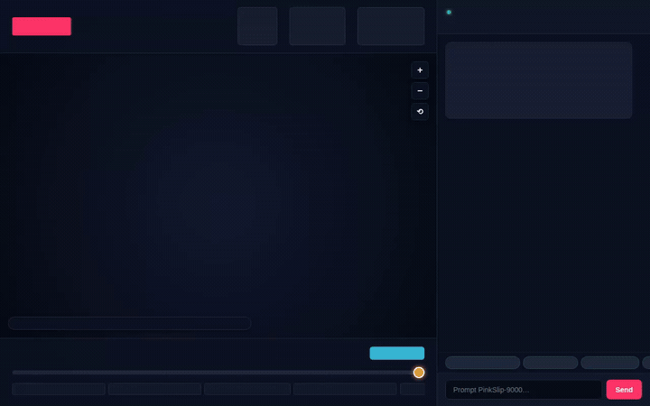

# 📉 PinkSlip-9000: The AI Automation Apocalypse Dashboard

> *A satirical dashboard and analytics agent tracking and visualizing AI-driven workforce layoffs across customizable regions and infinite time dials with corporate downsizing excuses, doom-gauges, and AI replacement metrics.*

<div align="center">



<br/>


</div>

---

## 📖 Overview

**PinkSlip-9000** is an agentic application developed for the Google Cloud *Build with Gemini* World Tour. It pairs an autonomous AI agent (grounded in corporate-satire persona) with an interactive dual-pane dashboard:

1. **Interactive World Map & Timeline (100 BC – 2026 AD)**: A tactile canvas-rendered 3D world map featuring extruded isometric bar graphs that scale across historical automation epochs (from Roman watermills and the Gutenberg printing press to the industrial loom and 2026 generative AI clusters). Includes continuous timeline scrubbing, epoch jumps, click-and-drag panning, mouse wheel zoom, and click-to-interrogate capabilities.
2. **Real-Time A2A Chat with Native A2UI Cards**: Communicates with the deployed Agent Runtime via the Agent-to-Agent (A2A) protocol, rendering structured A2UI card layouts natively in the browser alongside conversational text.

---

## 🛠️ Implemented Features & Google Cloud Services

The capabilities below are fully implemented and verified in the codebase (`app/agent.py` and `agents-cli-manifest.yaml`):

### 🧠 Vertex AI Memory Bank
- **Service**: Cross-session Long-Term Memory via `PreloadMemoryTool` and `generate_memories_callback` (`add_session_to_memory`).
- **Function**: Automatically remembers user-searched job titles, geographic regions, cynicism preferences, and historical scenarios across conversations.

### 🗄️ Google Cloud Firestore
- **Service**: Cloud Firestore collection `layoff_incidents`.
- **Function**: Persists and queries structured corporate layoff events, employee headcounts, AI replacement technologies, cynicism ratings, and executive euphemisms.
- **Wired Tools**:
  - `list_layoff_incidents`: Queries recorded downsizing incidents filtered by region and headcount.
  - `record_layoff_incident`: Logs newly reported layoff incidents and corporate buzzwords into the database.
  - `get_layoff_summary_stats`: Aggregates cohort totals, average cynicism ratings, and GPU cluster ratios.

### 🖼️ Multimodal Image Generation & Cloud Storage
- **Services**: `gemini-3.1-flash-lite-image` (Vertex AI Global) + Google Cloud Storage public bucket.
- **Function**: Synthesizes satirical, cyberpunk-style corporate "Certificate of Obsolescence" badges awarded to deprecated job roles.
- **Wired Tool**:
  - `generate_obsolescence_badge`: Generates image bytes via Gemini, saves the image as a local ADK tool artifact, uploads the binary to a public Cloud Storage bucket, and returns an HTTPS URL embedded directly into an A2UI Image card.

### 🧪 Agent Platform Code Sandbox Execution
- **Service**: `AgentEngineSandboxCodeExecutor` hosted on Vertex AI Agent Engine.
- **Function**: Securely runs Python code in an isolated cloud sandbox to perform mathematical simulations, replacement rate curves, and regression analyses.

### 📊 Algorithmic Obsolescence Index & Dynamic Charts
- **Wired Tools**:
  - `calculate_job_obsolescence_index`: Cross-references user job titles against Firestore historical incident logs to compute vulnerability percentages, replacement timelines, and survival advice.
  - `generate_layoff_chart_url`: Dynamically generates QuickChart.io data visualizer URLs for regional and corporate headcount distributions.

### 🌐 Live Public APIs & Feeds
- **Wired Tools**:
  - `find_surviving_jobs`: Queries the public Remotive API for active remote job openings for displaced workers.
  - `fetch_live_tech_layoffs`: Parses live Google News RSS feeds for breaking tech restructuring announcements.

### 🪟 A2UI (Agent-to-User Interface)
- Emits structured A2UI (v0.8 Basic Catalog) components (`Card`, `Column`, `Row`, `Text`, `Image`) via an `after_model_callback`. The frontend parses these payloads and renders rich visual cards inline.

---

## 🏗️ Project Architecture

```
BuildWithGemini/
├── assets/
│   ├── demo.gif                   # Screen recording of the agent in action
│   └── build-with-gemini-banner.png
├── project_brief.md               # Original design brief and tool specifications
├── pinkslip-9000/
│   ├── agents-cli-manifest.yaml   # Agent Runtime deployment manifest (us-east1)
│   ├── pyproject.toml             # Python dependencies (ADK, google-genai, firestore, storage)
│   ├── seed_data.py               # Firestore seeding script with historical & modern incidents
│   ├── app/
│   │   ├── agent.py               # Core ADK agent, tools, memory callback, and sandbox executor
│   │   └── a2ui_utils.py          # A2UI callback transformer for Agent Engine & ADK Web
│   └── frontend/
│       ├── main.py                # FastAPI proxy speaking A2A protocol to Reasoning Engine
│       └── static/
│           └── index.html         # Interactive 3D World Map canvas, timeline slider & A2UI chat
```

---

## 🚀 Local Setup & Run Instructions

### Prerequisites
- Python 3.11+
- `uv` package manager (`curl -LsSf https://astral.sh/uv/install.sh | sh`)
- `google-cloud-sdk` authenticated with Application Default Credentials (`gcloud auth application-default login`)

### 1. Run the Agent Locally (ADK Web)

To test the agent with the local development playground and Memory Bank service:

```bash
cd pinkslip-9000
uv run adk web . --port 8080 --reload_agents
```

### 2. Seed Sample Data into Firestore

```bash
cd pinkslip-9000
uv run python seed_data.py
```

### 3. Launch the Interactive Frontend & Map

The custom frontend connects the interactive 3D world map and timeline to the agent via the A2A protocol:

```bash
cd pinkslip-9000/frontend
python3 -m venv .venv
.venv/bin/pip install -r requirements.txt
PORT=8088 .venv/bin/python main.py
```

Open a web browser and navigate to port `8088` on your local host to explore the interactive timeline and interrogate the agent.

---

## 📜 License

Apache License 2.0. Built with Google Cloud Agent Platform and Gemini.
